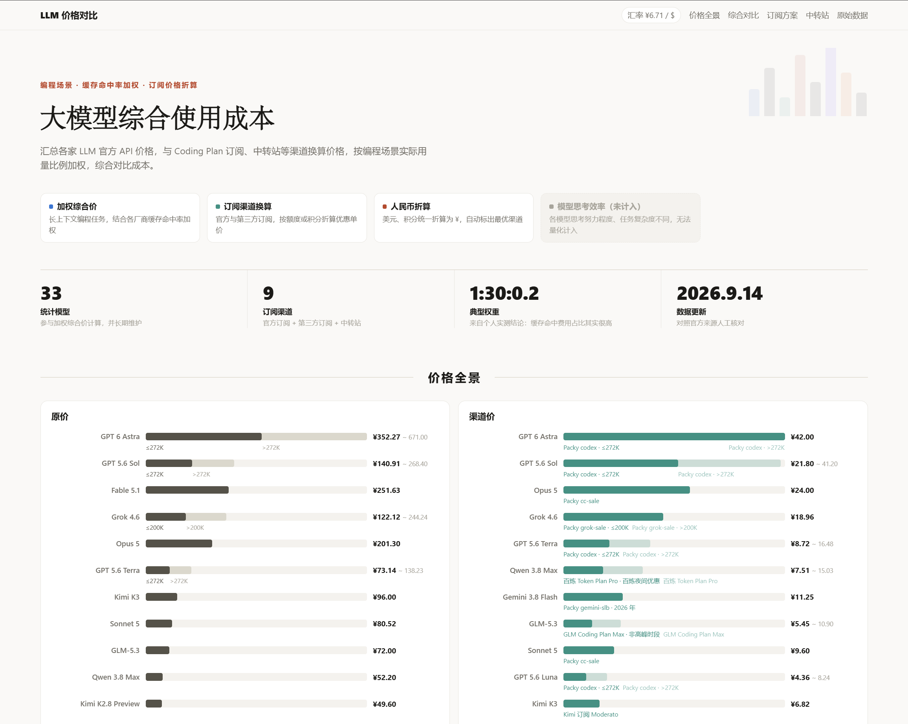

# 大模型综合使用成本(国内)

汇总各家 LLM 官方 API 价格，与 Coding Plan 订阅、中转站等渠道换算价格，按编程场景实际用量比例加权，综合对比成本。

## 综合价 ≈ 一次编码任务的开销 ≈ 符合印象的单位价格

*一次任务：指一次会话上下文长度 256K 左右的典型编码任务。*

*符合印象：指计算出的综合价刚好接近输出单价。（Grok、GLM 这类输出低价、缓存高价的模型，将被拉回统一标尺，暴露真实成本）*

> 非编码任务可能不适用该权重标定，仅供参考

---

**➡️ 在线访问：<https://xiaojhcc.github.io/llm-api-and-plan-pricing-in-china/>**

